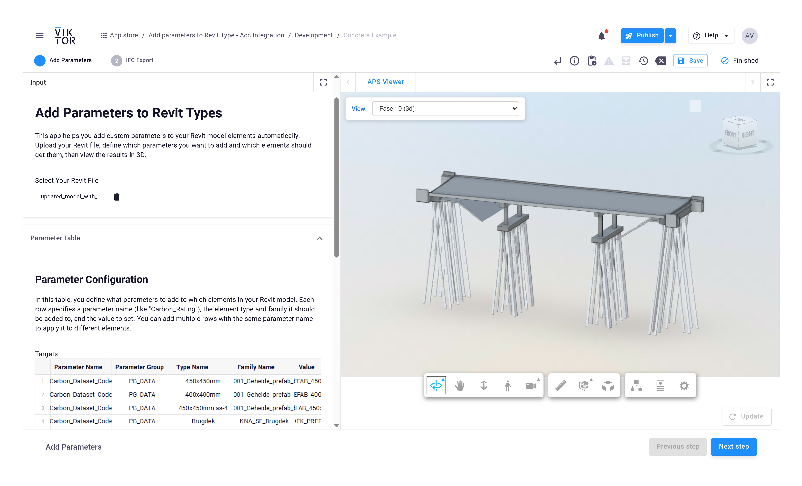
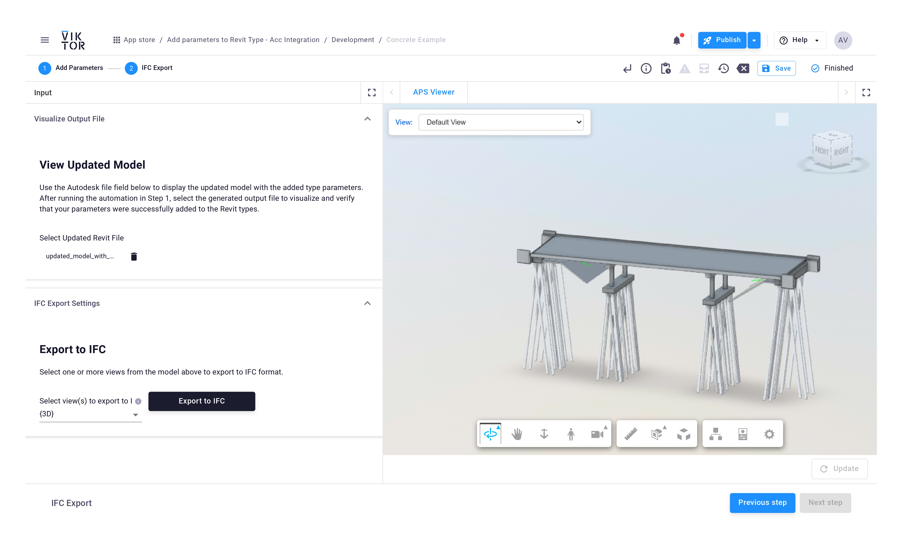

# Add Parameters to Revit Types (ACC Integration)

A VIKTOR app that automates adding custom parameters to Revit model types and exporting to IFC format, using Autodesk Construction Cloud (ACC) and Design Automation API.

## Features

### Step 1: Add Parameters to Revit Types

Upload your Revit file, define custom parameters in a table, and automatically add them to specific element types and families.



### Step 2: Export to IFC

Select views from your updated model and export them to IFC format for downstream use.



## Prerequisites

- VIKTOR platform account
- Autodesk Platform Services (APS) credentials
- Access to Autodesk Construction Cloud (ACC)

## Setup

### 1. Configure VIKTOR ACC Integration

Set up the VIKTOR ACC integration by following the official documentation:  
[VIKTOR - Autodesk Platform Services Integration](https://docs.viktor.ai/docs/create-apps/software-integrations/autodesk-platform-services/)

### 2. Create Design Automation Activities

You need to create two Design Automation activities in your APS account:

1. **Export to IFC Activity**  
   Follow: [create_activities_by_revit_version.ipynb (ExportIFC)](https://github.com/AlejoDuarte23/add-parameters-to-revit-types/blob/main/autodesk_automation%20-%20ExportIFC/create_activities_by_revit_version.ipynb)

2. **Add Parameters to Types Activity**  
   Follow: [create_activities_by_revit_version.ipynb (ChangeTypes)](https://github.com/AlejoDuarte23/add-parameters-to-revit-types/blob/main/autodesk_automation%20-%20ChangeTypes/create_activities_by_revit_version.ipynb)

### 3. Sign Activities for 3-Legged OAuth

To allow users with 3LO tokens (used in ACC) to work with the Design Automation API, activities need to be signed.

1. Follow the official guide:  
   [3-Legged OAuth Token Usage - APS Documentation](https://aps.autodesk.com/en/docs/design-automation/v3/developers_guide/3-legged-oauth-token-usage/)

2. Use the **APS Design Automation Signer** tool to generate signatures:  
   [aps-designautomation-signer](https://github.com/autodesk-platform-services/aps-designautomation-signer)

   This will generate a signature string for each activity and each supported Revit version (2023, 2024, 2025, 2026).

### 4. Configure Environment Variables

Copy `.env.sample` to `.env` and fill in your values:

```bash
cp .env.sample .env
```

The `.env` file requires:
- **Activity signatures** for each Revit version (generated by the signer tool)
- **Activity full aliases** in the format `<nickname>.ActivityName+<alias>`

See `.env.sample` for the complete list of required variables.

## Supported Revit Versions

- Revit 2023
- Revit 2024
- Revit 2025
- Revit 2026

The app automatically detects the Revit version from the uploaded model and uses the corresponding activity.

## Usage

1. **Step 1 - Add Parameters**
   - Select your Revit file from ACC
   - Configure the parameter table with:
     - Parameter Name
     - Parameter Group
     - Type Name
     - Family Name
     - Value
   - Click "Run Automation" to process

2. **Step 2 - IFC Export**
   - Select the updated Revit file
   - Choose views to export
   - Click "Export to IFC"

## License

MIT